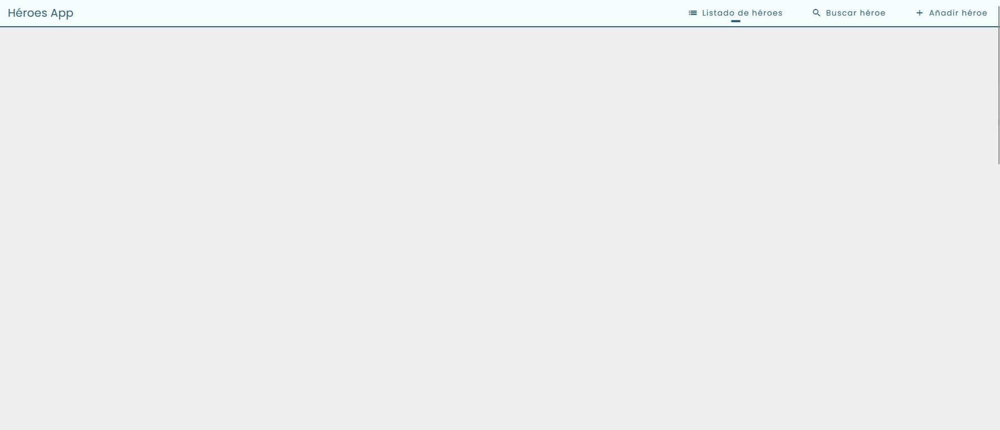
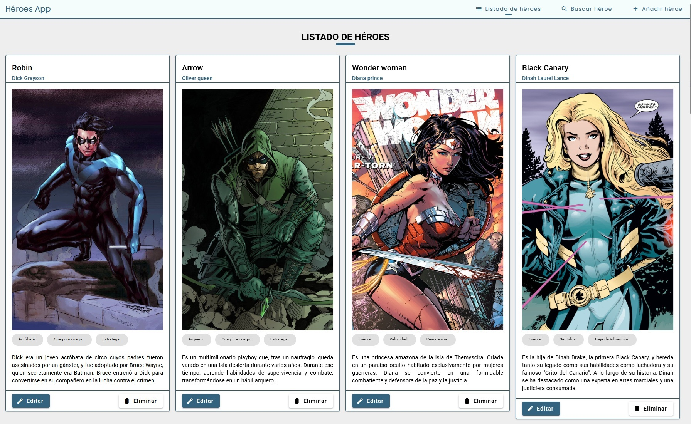
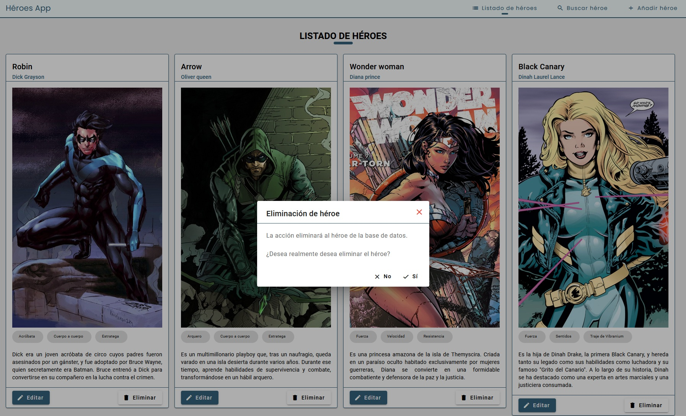
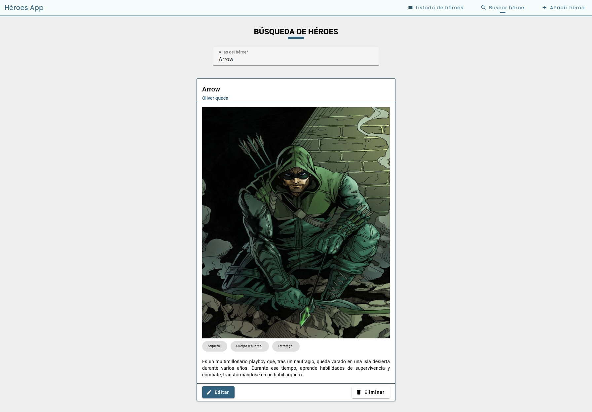
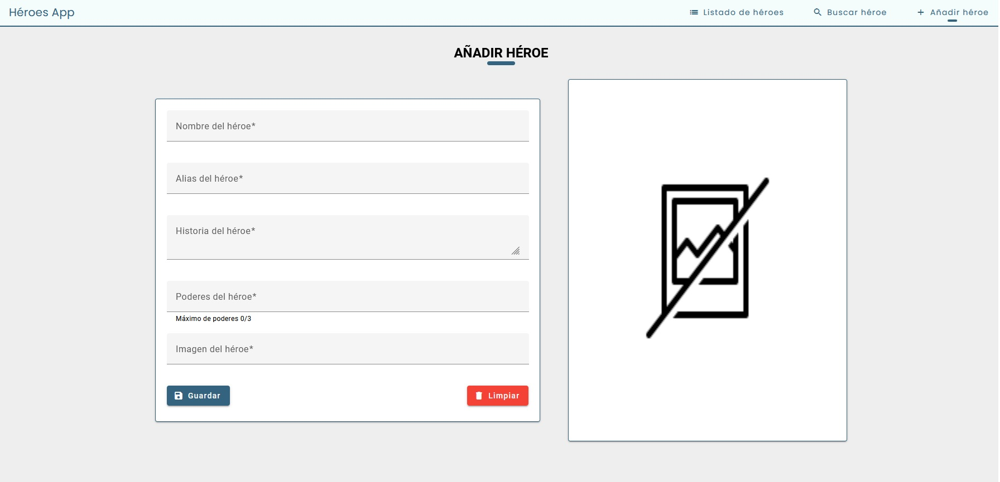
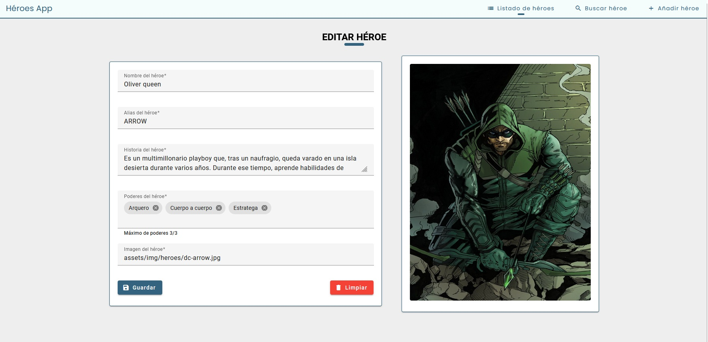
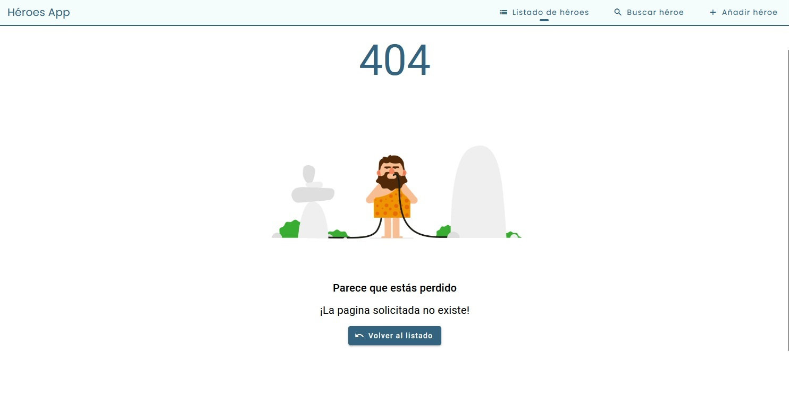

# Bienvenid@ a HéroesApp!

Éste proyecto ha sido generado con [Angular CLI](https://github.com/angular/angular-cli) versión 16.2.6.

Para probar los ejemplos de este repositorio, teclea los siguientes comandos:

1. Clona este repositorio en local:

```console
git clone https://github.com/Abel-Git2103/heroes-app.git
```

2. Entra en el directorio del proyecto:

```console
cd heroes-app
```

3. Instala las dependencias:

```console
npm install
```

4. Lanza el servidor para ver la aplicación en http://localhost:4200/:

```console
npm start
```

5. Lanza el JSON server para acceder a los datos de la aplicación en http://localhost:3000/:

```console
npm run server
```

### App Component

`app.component.html`

```html
<router-outlet></router-outlet>

<app-loading-indicator [detectRouteTransitions]="true"></app-loading-indicator>
```

`app.module.ts`

```typescript
import { NgModule } from '@angular/core';
import { BrowserModule } from '@angular/platform-browser';
import { BrowserAnimationsModule } from '@angular/platform-browser/animations';

import { HTTP_INTERCEPTORS } from '@angular/common/http';
import { MAT_SNACK_BAR_DEFAULT_OPTIONS } from '@angular/material/snack-bar';
import { AppRoutingModule } from './app-routing.module';
import { AppComponent } from './app.component';
import { ComponentsModule } from './components/components.module';
import { LoadingInterceptor } from './helpers/loading.interceptor';
import { SharedModule } from './shared/shared.module';

@NgModule({
    declarations: [AppComponent],
    imports: [BrowserModule, BrowserAnimationsModule, AppRoutingModule, SharedModule, ComponentsModule],
    providers: [
        {
            provide: HTTP_INTERCEPTORS,
            useClass: LoadingInterceptor,
            multi: true
        },
        { provide: MAT_SNACK_BAR_DEFAULT_OPTIONS, useValue: { duration: 3000, horizontalPosition: 'center', verticalPosition: 'bottom' } }
    ],
    bootstrap: [AppComponent]
})
export class AppModule {}
```

`app.routing.ts`

```typescript
import { NgModule } from '@angular/core';
import { RouterModule, Routes } from '@angular/router';
import { RecursoInexistenteComponent } from './shared/recurso-inexistente/recurso-inexistente.component';

const routes: Routes = [
    {
        path: 'app',
        loadChildren: () => import('./pages/pages.module').then((m) => m.PagesModule)
    },
    {
        path: 'recurso-inexistente',
        component: RecursoInexistenteComponent
    },
    {
        path: '',
        redirectTo: 'app',
        pathMatch: 'full'
    },
    {
        path: '**',
        redirectTo: 'recurso-inexistente'
    }
];

@NgModule({
    imports: [RouterModule.forRoot(routes)],
    exports: [RouterModule]
})
export class AppRoutingModule {}
```

### Estilos globales

`layout.component.css`

```css
/* Estilos globales */
@import url('https://fonts.googleapis.com/css?family=Poppins:400,700|Roboto:400,700&display=swap');

:root {
    --colorPrincipal: #33637e;
    --colorSecundario: #f4fcfc;
    --fuenteSecundaria: 'Poppins', sans-serif;
}

html,
body {
    height: 100%;
}

body {
    margin: 0;
    font-family: Roboto, 'Helvetica Neue', sans-serif;
}

.custom-heading-container {
    display: flex;
    justify-content: center;
}

.custom-heading-container h1 {
    text-transform: uppercase;
    font-weight: 700;
    color: #000;
    position: relative;
}

.custom-heading-container h1::before {
    content: '';
    position: absolute;
    bottom: -7px;
    left: 50%;
    width: 50px;
    height: 7px;
    -webkit-transform: translateX(-50%);
    transform: translateX(-50%);
    background-color: var(--colorPrincipal);
    border-radius: 15px;
}

/* --------------------------- */
```

### Páginas

`pages.module.ts`

```typescript
import { NgModule } from '@angular/core';
import { SharedModule } from '../shared/shared.module';
import { PagesRoutingModule } from './pages-routing.module';

import { ComponentsModule } from '../components/components.module';
import { BusquedaComponent } from './busqueda/busqueda.component';
import { HeroeComponent } from './heroe/heroe.component';
import { LayoutComponent } from './layout/layout.component';
import { ListadoComponent } from './listado/listado.component';
import { RecursoInexistenteComponent } from './recurso-inexistente/recurso-inexistente.component';

@NgModule({
    declarations: [LayoutComponent, BusquedaComponent, ListadoComponent, HeroeComponent, RecursoInexistenteComponent],
    imports: [SharedModule, ComponentsModule, PagesRoutingModule],
    providers: []
})
export class PagesModule {}
```

`pages-routing.module.ts`

```typescript
import { NgModule } from '@angular/core';
import { RouterModule, Routes } from '@angular/router';
import { globalResolver } from '../resolvers/global.resolver';
import { Constants } from '../shared/models/constants.model';
import { BusquedaComponent } from './busqueda/busqueda.component';
import { HeroeComponent } from './heroe/heroe.component';
import { LayoutComponent } from './layout/layout.component';
import { ListadoComponent } from './listado/listado.component';

const routes: Routes = [
    {
        path: '',
        component: LayoutComponent,
        children: [
            {
                path: 'busqueda',
                component: BusquedaComponent,
                resolve: { busquedaData: globalResolver }
            },
            {
                path: 'nuevo-heroe',
                component: HeroeComponent,
                data: { mode: Constants.pageHeroMode[2] }
            },
            {
                path: 'editar-heroe/:id',
                component: HeroeComponent,
                data: { mode: Constants.pageHeroMode[1] },
                resolve: { heroe: globalResolver, id: globalResolver }
            },
            {
                path: 'listado',
                component: ListadoComponent,
                resolve: { listadoData: globalResolver }
            },
            // TODO: Visualizar pantalla de héroe
            /*             {
                path: 'heroe/:id',
                component: HeroeComponent,
                data: { mode: Constants.pageHeroMode[0] }
            }, */
            {
                path: '**',
                redirectTo: 'listado'
            }
        ]
    }
];

@NgModule({
    imports: [RouterModule.forChild(routes)],
    exports: [RouterModule]
})
export class PagesRoutingModule {}
```

## Página 1 - Layout.

`layout.component.css`

```css
/* Estilos del toolbar */
.layout-toolbar {
    background-color: var(--colorSecundario);
    color: var(--colorPrincipal);
    font-family: var(--fuenteSecundaria);
    border-bottom: 2px solid var(--colorPrincipal);
    height: 50px;
    position: fixed;
    top: 0;
    z-index: 2;
}

.container {
    margin-top: 80px;
}

.espaciado {
    flex: 1 1 auto;
}

/* Estilo de los botones del toolbar */
.buttonsToolbar {
    font-family: var(--fuenteSecundaria);
    margin-left: 2%;

    &::before {
        content: '';
        display: none;
        position: absolute;
        bottom: 1px;
        left: 50%;
        width: 17px;
        height: 4px;
        transform: translateX(-50%);
        background-color: var(--colorPrincipal);
        border-radius: 5px;
    }

    &:hover {
        &::before {
            display: block;
        }
    }

    &.active {
        &::before {
            display: block;
        }
    }
}

.mat-mdc-button {
    --mat-mdc-button-persistent-ripple-color: none;
}

/* Toggle del toolbar */
.toggleButton {
    position: relative;
    width: 30px;
    height: 30px;
    display: flex;
    justify-content: center;
    align-items: center;
    cursor: pointer;
    overflow: hidden;
    background: var(--colorPrincipal);
    border-radius: 4px;
}

.toggleButton span {
    position: absolute;
    width: 26px;
    height: 3px;
    background: var(--colorSecundario);
    border-radius: 4px;
    transition: 0.5s;
}

/* Primera rallita del toggle */
.toggleButton span:nth-child(1) {
    transform: translateY(-9px);
    width: 18px;
    left: 2px;
}

/* Al pasar el ratón, alargo la ralla */
.toggleButton:hover span:nth-child(1) {
    width: 26px;
}

/* Cuando haga clic, rotará 45 grados */
.toggleButton.active span:nth-child(1) {
    width: 26px;
    transform: translateY(0px) rotate(45deg);
}

/* Tercera rallita del toggle */
.toggleButton span:nth-child(2) {
    transform: translateY(9px);
    width: 18px;
    left: 2px;
}

/* Al pasar el ratón, alargo la ralla */
.toggleButton:hover span:nth-child(2) {
    width: 26px;
}

/* Cuando haga clic, rotará 45 grados */
.toggleButton.active span:nth-child(2) {
    width: 26px;
    transform: translateY(0px) rotate(-45deg);
}

/* Segunda rallita del toggle */
/* Cuando hago clic, desaparece la ralla hacia la derecha */
.toggleButton.active span:nth-child(3) {
    transform: translateX(60px);
}

/* Estilos de los botones colapsados del navbar */
.toolbarButtonsCollapsed {
    position: fixed;
    left: 0;
    top: 50px;
    width: 100%;
    background-color: var(--colorSecundario);
    display: flex;
    flex-direction: column;
    border-bottom: 3px solid var(--colorPrincipal);
    z-index: 2;
}

.btnCollapsed {
    font-family: var(--fuenteSecundaria);
    height: 45px;
    margin: 0;
    border-radius: 0;
    border-bottom: 1px solid var(--colorPrincipal);
}

/* --------------------------- */
```

`layout.component.html`

```html
<!-- Toolbar -->
<mat-toolbar #toolbar class="layout-toolbar" fullscreen>
    <span>Héroes App</span>
    <span class="espaciado"></span>

    <!-- Template que muestra los botones cuando la pantalla está por encima de 680px -->
    <ng-container *ngIf="showToolbarButtons; else showToggle">
        <button mat-button [disableRipple]="true" class="buttonsToolbar btnListado" (click)="switchActiveClass('btnListado')" [routerLink]="['/app/listado']">
            <mat-icon aria-hidden="false" aria-label="Visualizar listado" fontIcon="list"></mat-icon><span>Listado de héroes</span>
        </button>
        <button mat-button [disableRipple]="true" class="buttonsToolbar btnBuscar" (click)="switchActiveClass('btnBuscar')" [routerLink]="['/app/busqueda']">
            <mat-icon aria-hidden="false" aria-label="Búsqueda de héroe" fontIcon="search"></mat-icon><span>Buscar héroe</span>
        </button>
        <button mat-button [disableRipple]="true" class="buttonsToolbar btnNuevo" (click)="switchActiveClass('btnNuevo')" [routerLink]="['/app/nuevo-heroe']">
            <mat-icon aria-hidden="false" aria-label="Inserción de héroe" fontIcon="add"></mat-icon><span>Añadir héroe</span>
        </button>
    </ng-container>

    <!-- Template que muestra el toggle cuando la pantalla está por debajo de 680px -->
    <ng-template #showToggle>
        <div class="toggleButton" (click)="switchToggleButton()">
            <span></span>
            <span></span>
            <span></span>
        </div>
    </ng-template>

    <!-- Template que se muestra cuando la pantalla está por debajo de 1060px al clicar en el toggle button -->
    <ng-container *ngIf="showCollapsedToolbar && !showToolbarButtons">
        <div class="toolbarButtonsCollapsed">
            <button mat-button class="btnCollapsed btnListado" (click)="switchActiveClass('btnListado')" [routerLink]="['/app/listado']">
                <mat-icon aria-hidden="false" aria-label="Visualizar listado" fontIcon="list"></mat-icon><span>Listado de héroes</span>
            </button>
            <button mat-button class="btnCollapsed btnBuscar" (click)="switchActiveClass('btnBuscar')" [routerLink]="['/app/busqueda']">
                <mat-icon aria-hidden="false" aria-label="Búsqueda de héroe" fontIcon="search"></mat-icon><span>Buscar héroe</span>
            </button>
            <button mat-button class="btnCollapsed btnNuevo" (click)="switchActiveClass('btnNuevo')" [routerLink]="['/app/nuevo-heroe']">
                <mat-icon aria-hidden="false" aria-label="Inserción de héroe" fontIcon="add"></mat-icon><span>Añadir héroe</span>
            </button>
        </div>
    </ng-container>
</mat-toolbar>

<!-- Contenedor principal del routing -->
<div class="container mx-3">
    <router-outlet></router-outlet>
</div>

</p>
```



## Página 2 - Listado de héroes.

`listado.component.html`

```html
<!-- Contenedor del título de la página -->
<div class="custom-heading-container mb-3"><h1>Listado de héroes</h1></div>

<!-- Grid que muestra el listado de heroés ajustando número de columnas al cambiar tamaño de ventanta para que sea responsive -->
<div class="flex-layout-container" fxLayout="row wrap" fxLayout.lt-sm="column" fxLayoutGap="15px" fxLayoutAlign="flex-start">
    <ng-container *ngFor="let heroe of listadoHeroes">
        <app-hero-card
            [heroe]="heroe"
            (actualizarListado)="updateHeroesList()"
            fxFlex="0 1 calc(20% - 15px)"
            fxFlex.lt-xl="0 1 calc(25% - 15px)"
            fxFlex.lt-lg="0 1 calc(33.3% - 15px)"
            fxFlex.lt-md="0 1 calc(50% - 15px)"
            fxFlex.lt-sm="100%"
        ></app-hero-card>
    </ng-container>
</div>
```

`listado.component.ts`

```typescript
import { Component, OnInit, inject } from '@angular/core';
import { MatSnackBar } from '@angular/material/snack-bar';
import { ActivatedRoute, Router } from '@angular/router';
import { HeroesService } from 'src/app/services/heroes.service';
import { Constants } from 'src/app/shared/models/constants.model';
import { Heroe } from 'src/app/shared/models/heroe.model';

@Component({
    selector: 'app-listado',
    templateUrl: './listado.component.html',
    styleUrls: ['./listado.component.css']
})
export class ListadoComponent implements OnInit {
    /* Propiedades del listado */
    public listadoHeroes: Heroe[] = [];

    /* Propiedades constantes */
    public URLS = Object.freeze(Constants.appUrls);

    /* Inyección de dependencias */
    private _route: ActivatedRoute = inject(ActivatedRoute);
    private _router: Router = inject(Router);

    private _heroesService: HeroesService = inject(HeroesService);
    private _snackBar: MatSnackBar = inject(MatSnackBar);

    ngOnInit(): void {
        this._getHeroesList();
    }

    /* PUBLIC METHODS */
    /* Navega a la página indicada */
    navigateToEdit(id: string) {
        this._router.navigate([this.URLS.editarHeroe, id]);
    }

    /* Obtiene del servicio el listado de heroes después de eliminar uno para recargar el listado */
    updateHeroesList() {
        this._heroesService.obtenerListadoHeroes().subscribe({
            next: (listadoHeroes: Heroe[]) => {
                this.listadoHeroes = listadoHeroes;
            },
            error: () => {
                this._snackBar.open('Se ha producido un error al actualizar el listado', 'Cerrar');
            }
        });
    }

    /* PRIVATE METHODS */
    /* Obtiene el listado de héroes del resolver */
    private _getHeroesList() {
        this.listadoHeroes = this._route.snapshot.data['listadoData'];
    }
}
```





## Página 3 - Buscador de héroe.

`busqueda.component.css`

```css
/* Estilos del buscador */
.form-container {
    display: flex;
    justify-content: center;
    align-items: center;
    flex-direction: column;
}

.search-form {
    min-width: 150px;
    max-width: 500px;
    width: 100%;
}

.form-full-width {
    width: 100%;
}

.results-container {
    display: flex;
    justify-content: center;
}

/* --------------------------- */
```

`busqueda.component.html`

```html
<!-- Contenedor del título de la página -->
<div class="custom-heading-container mb-3"><h1>Búsqueda de héroes</h1></div>

<!-- Contiene el input del formulario -->
<div class="form-container">
    <!-- Formulario de búsqueda de héroe -->
    <form class="search-form">
        <mat-form-field class="form-full-width">
            <mat-label>Alias del héroe</mat-label>
            <input type="text" aria-label="Buscador de héroe" matInput [formControl]="inputSearchControl" autocomplete="off" [matAutocomplete]="auto" />
            <mat-autocomplete #auto="matAutocomplete" (optionSelected)="seleccionarHeroe()">
                <mat-option *ngFor="let alias of filteredOptions | async" [value]="alias">
                    {{ alias }}
                </mat-option>
                <mat-option value="" *ngIf="!filterData"> Sin resultados con la búsqueda {{ inputSearchControl.value }} </mat-option>
            </mat-autocomplete>
            <mat-error *ngIf="inputSearchControl.hasError('required')"> Debe ingresar un alias de héroe </mat-error>
        </mat-form-field>
    </form>
</div>

<!-- Contiene el resultado de la búsqueda -->
<div class="results-container" fxLayout="row" fxLayout.lt-sm="column" fxLayoutGap="15px">
    <ng-container *ngIf="heroeSelected">
        <app-hero-card
            class="mt-3"
            [heroe]="heroeSelected"
            fxFlex="0 1 calc(35% - 15px)"
            fxFlex.lt-xl="0 1 calc(35% - 15px)"
            fxFlex.lt-lg="0 1 calc(60% - 15px)"
            fxFlex.lt-md="0 1 calc(80% - 15px)"
            fxFlex.lt-sm="100%"
        ></app-hero-card>
    </ng-container>
</div>
```

`busqueda.component.ts`

```typescript
import { Component, inject } from '@angular/core';
import { FormControl, FormGroup, Validators } from '@angular/forms';
import { MatSnackBar } from '@angular/material/snack-bar';
import { ActivatedRoute } from '@angular/router';
import { Observable, map, startWith } from 'rxjs';
import { HeroesService } from 'src/app/services/heroes.service';
import { Heroe } from 'src/app/shared/models/heroe.model';

@Component({
    selector: 'app-busqueda',
    templateUrl: './busqueda.component.html',
    styleUrls: ['./busqueda.component.css']
})
export class BusquedaComponent {
    /* Propiedades del formulario */
    public searchForm!: FormGroup;
    public inputSearchControl: FormControl = new FormControl('');
    public heroesAlias: string[] = [];
    public filteredOptions!: Observable<string[]>;
    public filterData: boolean = false;
    public heroeSelected!: Heroe;

    /* Inyección de dependencias */
    private _route: ActivatedRoute = inject(ActivatedRoute);
    private _heroesService: HeroesService = inject(HeroesService);
    private _snackBar: MatSnackBar = inject(MatSnackBar);

    ngOnInit() {
        this.initForm();
    }

    /* PUBLIC METHODS */
    /* Inicializa el formulario y el observable del input para llamar a la función de filtrado */
    initForm() {
        this.heroesAlias = this._route.snapshot.data['busquedaData'];

        this.inputSearchControl = new FormControl('', Validators.required);

        this.filteredOptions = this.inputSearchControl.valueChanges.pipe(
            startWith(''),
            map((value) => this._filterData(value || ''))
        );
    }

    /* Permite seleccionar al héroe y cargar sus datos */
    seleccionarHeroe() {
        const id: string = this.inputSearchControl.value.toLowerCase().replace(/\s/g, '-');

        this._heroesService.obtenerHeroePorId(id).subscribe({
            next: (heroe: Heroe) => {
                this.heroeSelected = heroe;
            },
            error: () => {
                this._snackBar.open('Se ha producido un error al obtener el héroe seleccionado', 'Cerrar');
            }
        });
    }

    /* PRIVATE METHODS */
    /* Permite filtrar en el listado de alias de héroes según el texto introducido en el input */
    private _filterData(value: string): string[] {
        const filterValue = value.toLowerCase();
        const dataFiltered: string[] = this.heroesAlias.filter((option) => option.toLowerCase().startsWith(filterValue));
        this.filterData = dataFiltered?.length > 0;

        return dataFiltered;
    }
}
```



## Página 4 - Añadir/Editar héroe.

En función de la ruta a la que navegamos `/app/nuevo-heroe` o `/app/editar-heroe/:id` le pasamos al componente el indicador "*modePage*" para diferenciar entre alta, edición o visualización

`heroe.component.css`

```css
/* Estilos de los templates */
.cards-container {
    display: flex;
    justify-content: center;
    align-items: center;
}

.card-column {
    padding: 20px;
    border: 1px solid var(--colorPrincipal);
    height: fit-content;
}

.card-column-image {
    padding: 20px;
    border: 1px solid var(--colorPrincipal);
    width: 100%;
    max-width: 500px;
    height: 650px;
}

img {
    width: 100%;
    max-width: 500px;
    height: 600px;
}

.form-container {
    height: fit-content;
}

.mat-text-area {
    max-height: 70px;
}

mat-card-actions {
    display: flex;
    justify-content: space-between;
    width: 100%;
}

.card-button-green {
    background-color: var(--colorPrincipal);
}

/* --------------------------- */
```

`heroe.component.html`

```html
<ng-container *ngTemplateOutlet="selectedTemplate"></ng-container>

<!-- Template que se renderiza en el modo edición -->
<ng-template #edicionTemplate>
    <!-- Contenedor del título de la página -->
    <div class="custom-heading-container mb-3">
        <ng-container *ngIf="modePage['clave'] === PAGEMODES[1]['clave']; else altaPage"><h1>Editar héroe</h1></ng-container>
        <ng-template #altaPage><h1>Añadir héroe</h1></ng-template>
    </div>

    <div class="cards-container" fxLayout="row" fxLayout.lt-sm="column" fxLayout.lt-md="column" fxLayout.lt-lg="column" fxLayoutGap="50px">
        <!-- Tarjeta que contiene la información del héroe -->
        <mat-card
            class="card-column"
            fxFlex="0 1 calc(40% - 15px)"
            fxFlex.lt-xl="0 1 calc(40% - 15px)"
            fxFlex.lt-lg="0 1 calc(40% - 15px)"
            fxFlex.lt-md="100%"
            fxFlex.lt-sm="100%"
        >
            <!-- Formulario de inserción de héroe -->
            <form [formGroup]="heroeForm" class="form-container grid" (ngSubmit)="guardarHeroe()">
                <!-- Input del nombre de héroe -->
                <mat-form-field class="col-12">
                    <mat-label>Nombre del héroe</mat-label>
                    <input type="text" aria-label="Nombre del héroe" matInput formControlName="nombre" autocomplete="off" required />
                    <mat-error *ngIf="heroeForm.get('nombre')?.hasError('required')"> Debe ingresar el nombre del héroe </mat-error>
                </mat-form-field>

                <!-- Input de alias del héroe -->
                <mat-form-field class="col-12">
                    <mat-label>Alias del héroe</mat-label>
                    <input type="text" aria-label="Alias del héroe" matInput appUpperCase formControlName="alias" autocomplete="off" required />
                    <mat-error *ngIf="heroeForm.get('alias')?.hasError('required')"> Debe ingresar el alias del héroe </mat-error>
                </mat-form-field>

                <!-- Input de historia del héroe -->
                <mat-form-field class="col-12">
                    <mat-label>Historia del héroe</mat-label>
                    <textarea class="mat-text-area" matInput aria-label="Historia del héroe" formControlName="historia" autocomplete="off" required></textarea>
                    <mat-error *ngIf="heroeForm.get('historia')?.hasError('required')"> Debe ingresar la historia del héroe </mat-error>
                </mat-form-field>

                <!-- Input de poderes del héroe -->
                <mat-form-field class="col-12">
                    <mat-label>Poderes del héroe</mat-label>
                    <mat-chip-grid #chipGrid aria-label="Inserción de poder" formControlName="poderes" required>
                        <mat-chip-row *ngFor="let poder of heroe.poderes" (removed)="eliminarPoder(poder)">
                            {{ poder }}
                            <button matChipRemove [attr.aria-label]="'Eliminar ' + poder">
                                <mat-icon fontIcon="cancel"></mat-icon>
                            </button>
                        </mat-chip-row>
                    </mat-chip-grid>
                    <input
                        #poderesInput
                        [placeholder]="checkMaxChips() ? 'Se ha introducido el número máximo de poderes' : 'Pulsa intro para insertar poder...'"
                        matInput
                        [readonly]="checkMaxChips()"
                        aria-label="Poderes del héroe"
                        [matChipInputFor]="chipGrid"
                        [matChipInputSeparatorKeyCodes]="separatorKeysCodes"
                        (matChipInputTokenEnd)="insertarPoder($event)"
                    />
                    <mat-hint align="start">Máximo de poderes {{ heroe.poderes.length }}/3</mat-hint>
                    <mat-error *ngIf="heroeForm.get('poderes')?.hasError('required')"> Debe ingresar algún poder del héroe </mat-error>
                </mat-form-field>

                <!-- Input de imagen del héroe -->
                <mat-form-field class="col-12">
                    <mat-label>Imagen del héroe</mat-label>
                    <input
                        type="text"
                        aria-label="Imagen del héroe"
                        matInput
                        formControlName="imagen"
                        autocomplete="off"
                        required
                        placeholder="Inserta la URL de la imagen..."
                    />
                    <mat-error *ngIf="heroeForm.get('imagen')?.hasError('required')"> Debe insertar una imagen del héroe </mat-error>
                </mat-form-field>

                <!-- Contenedor de los botones de la tarjeta -->
                <mat-card-actions>
                    <button mat-raised-button color="primary" class="card-button-green">
                        <mat-icon aria-hidden="false" aria-label="Añadir héroe" fontIcon="save"></mat-icon><span>Guardar</span>
                    </button>
                    <button mat-raised-button color="warn" (click)="resetForm()">
                        <mat-icon aria-hidden="false" aria-label="Limpiar formulario" fontIcon="delete"></mat-icon><span>Limpiar</span>
                    </button>
                </mat-card-actions>
            </form>
        </mat-card>

        <!-- Tarjeta que contiene la imagen del héroe -->
        <mat-card
            class="card-column-image"
            fxFlex="0 1 calc(40% - 15px)"
            fxFlex.lt-xl="0 1 calc(40% - 15px)"
            fxFlex.lt-lg="0 1 calc(40% - 15px)"
            fxFlex.lt-md="100%"
            fxFlex.lt-sm="100%"
        >
            
        </mat-card>
    </div>
</ng-template>

<!-- TODO: Mostrar pantalla individual del héroe -->
<!-- Template que se renderiza en el modo solo lectura -->
<ng-template #readOnlyTemplate>READONLY</ng-template>
```

`heroe.component.ts`

```typescript
import { COMMA, ENTER } from '@angular/cdk/keycodes';
import { NgTemplateOutlet } from '@angular/common';
import { AfterContentChecked, Component, OnInit, TemplateRef, ViewChild, inject } from '@angular/core';
import { FormBuilder, FormGroup, Validators } from '@angular/forms';
import { MatChipInputEvent } from '@angular/material/chips';
import { MatSnackBar } from '@angular/material/snack-bar';
import { ActivatedRoute, Router } from '@angular/router';
import { HeroesService } from 'src/app/services/heroes.service';
import { ClaveValor, Constants } from 'src/app/shared/models/constants.model';
import { Heroe } from 'src/app/shared/models/heroe.model';

@Component({
    selector: 'app-heroe',
    templateUrl: './heroe.component.html',
    styleUrls: ['./heroe.component.css']
})
export class HeroeComponent implements OnInit, AfterContentChecked {
    @ViewChild('edicionTemplate') edicionTemplate!: TemplateRef<NgTemplateOutlet>;
    @ViewChild('readOnlyTemplate') readOnlyTemplate!: TemplateRef<NgTemplateOutlet>;

    /* Inyección de dependencias */
    private _route: ActivatedRoute = inject(ActivatedRoute);
    private _router: Router = inject(Router);
    private _formBuilder: FormBuilder = inject(FormBuilder);
    private _heroesService: HeroesService = inject(HeroesService);
    private _snackBar: MatSnackBar = inject(MatSnackBar);

    /* Propiedades constantes */
    public PAGEMODES = Object.freeze(Constants.pageHeroMode);
    public URLS = Object.freeze(Constants.appUrls);

    /* Propiedades de los templates */
    public modePage!: ClaveValor;
    public selectedTemplate!: TemplateRef<any>;
    public heroeForm!: FormGroup;
    public heroe: Heroe = new Heroe();
    public separatorKeysCodes: number[] = [ENTER, COMMA];
    public maxChips: boolean = false;

    /* Recupera los valores del formulario */
    get heroeActual(): Heroe {
        const heroe: Heroe = this.heroeForm.value as Heroe;
        return heroe;
    }

    ngOnInit() {
        /* Recuperamos el modo de página para mostrar el tamplate correspondiente si es alta, edición o visualización */
        this.modePage = this._route.snapshot.data['mode'];

        /* Recuperamos los datos del heroe del resolver */
        if (this._route.snapshot.data['heroe']) {
            this.heroe = this._route.snapshot.data['heroe'];
        }

        this._initForm();
    }

    ngAfterContentChecked() {
        this.selectedTemplate = this._selectTemplateRef(this.modePage.clave);
    }

    /* Inserta en el array de poderes el poder introducido en el input */
    insertarPoder(event: MatChipInputEvent) {
        let value = (event.value || '').trim();

        // Añadimos el poder al array
        if (value) {
            /* Capitalizamos la primera letra y las demás en minúsculas */
            value = value.charAt(0).toUpperCase() + value.slice(1).toLowerCase();

            this.heroe.poderes.push(value);
        }

        // Limpiamos los datos del input despúes de insertarlo al array
        event.chipInput!.clear();
        this.heroeForm.get('poderes')?.setValue([]);

        /* Oculto errores required si los hay */
        this.heroeForm.get('poderes')?.setErrors(null);
    }

    /* Elimina del array de poderes el poder seleccionado */
    eliminarPoder(poder: string) {
        const index = this.heroe.poderes.indexOf(poder);

        if (index >= 0) {
            this.heroe.poderes.splice(index, 1);
        }

        /* Valido si el array de poderes tiene datos para mostrar u ocultar el error required */
        this.heroe?.poderes.length > 0 ? this.heroeForm.get('poderes')?.setErrors(null) : this.heroeForm.get('poderes')?.setErrors({ required: true });
    }

    /* Permite insertar o modificar el héroe en función del modo en el que me encuentre (0,1,2) */
    guardarHeroe() {
        if (this.heroeForm.invalid) return;

        this.ajustarGramatica();

        if (this.modePage.clave === this.PAGEMODES[2]['clave']) {
            this._heroesService.insertarHeroe(this.heroeActual).subscribe({
                next: (heroeInsertado: Heroe) => {
                    this.heroe = heroeInsertado;
                    this._router.navigate([this.URLS.listado]);
                    this._snackBar.open('Héroe insertado correctamente', 'Cerrar');
                },
                error: () => {
                    this._snackBar.open('Se ha producido un error al insertar el héroe', 'Cerrar');
                }
            });
        } else {
            this._heroesService.modificarHeroe(this.heroeActual).subscribe({
                next: (heroeModificado: Heroe) => {
                    this.heroe = heroeModificado;
                    this._router.navigate([this.URLS.listado]);
                    this._snackBar.open('Héroe modificado correctamente', 'Cerrar');
                },
                error: () => {
                    this._snackBar.open('Se ha producido un error al modificar el héroe', 'Cerrar');
                }
            });
        }
    }

    /* Revisa el número máximo de poderes introducidos en el héroe para poder bloquear el campo y cambiar el placeholder */
    checkMaxChips(): boolean {
        return this.heroe.poderes.length === 3;
    }

    /* Resetea los valores del formulario */
    resetForm() {
        this.heroeForm.reset();
        this.heroe.poderes = [];
    }

    /* Inicializa el formulario */
    private _initForm() {
        this.heroeForm = this._formBuilder.group({
            id: [this.modePage.clave === this.PAGEMODES[2]['clave'] ? '' : this.heroe.id],
            nombre: [this.modePage.clave === this.PAGEMODES[2]['clave'] ? '' : this.heroe.nombre, Validators.required],
            alias: [this.modePage.clave === this.PAGEMODES[2]['clave'] ? '' : this.heroe.alias.toUpperCase(), Validators.required],
            historia: [this.modePage.clave === this.PAGEMODES[2]['clave'] ? '' : this.heroe.historia, Validators.required],
            poderes: [this.modePage.clave === this.PAGEMODES[2]['clave'] ? '' : this.heroe.poderes, Validators.required],
            imagen: [this.modePage.clave === this.PAGEMODES[2]['clave'] ? '' : this.heroe.imagen, Validators.required]
        });
    }

    /* En función del modo que nos llega al navegar, renderizamos el template correspondiente */
    private _selectTemplateRef(mode: number): TemplateRef<any> {
        if (mode === this.PAGEMODES[0]['clave']) {
            return this.readOnlyTemplate;
        } else if (mode === this.PAGEMODES[1]['clave'] || mode === this.PAGEMODES[2]['clave']) {
            return this.edicionTemplate;
        } else {
            return this.selectedTemplate;
        }
    }

    /* Corregimos la gramatica de los inputs antes de guardarlos */
    private ajustarGramatica() {
        if (this.heroeActual) {
            this.heroeActual.id = this.heroeActual.alias.toLowerCase().replace(/\s/g, '-');
            this.heroeActual.nombre = this.heroeActual.nombre.charAt(0).toUpperCase() + this.heroeActual.nombre.slice(1).toLowerCase();
            this.heroeActual.alias = this.heroeActual.alias.charAt(0).toUpperCase() + this.heroeActual.alias.slice(1).toLowerCase();
        }
    }
}
```




## Página 5 - Recurso inexistente.

`recurso-inexixstente.component.css`

```css
/* Estilos de página 404 */
.recurso-inexistente {
    background: #fff;
    margin-top: 200px;
}

.flex-layout-container {
    justify-content: center;
    text-align: center;
}

img {
    width: 100%;
}

h1 {
    font-size: 80px;
    color: var(--colorPrincipal);
}

.text-container {
    margin-top: -50px;
}

p {
    font-size: 20px;
}

.card-button-green {
    background-color: var(--colorPrincipal);
}

/* --------------------------- */
```

`recurso-inexixstente.component.html`

```html
<section class="recurso-inexistente" fxLayout="row wrap" fxLayout.lt-sm="column" fxLayoutAlign="center">
    <div
        class="flex-layout-container"
        fxFlex="0 1 calc(40% - 15px)"
        fxFlex.lt-xl="0 1 calc(40% - 15px)"
        fxFlex.lt-lg="0 1 calc(40% - 15px)"
        fxFlex.lt-md="0 1 calc(60% - 15px)"
        fxFlex.lt-sm="100%"
    >
        <div class="image-container">
            <h1 class="text-center">404</h1>
            
        </div>

        <div class="text-container">
            <h2>Parece que estás perdido</h2>

            <p>¡La pagina solicitada no existe!</p>
        </div>

        <button mat-raised-button color="primary" class="card-button-green mt-2" [routerLink]="['/app/listado']">
            <mat-icon aria-hidden="false" aria-label="Editar héroe" fontIcon="undo"></mat-icon><span>Volver al listado</span>
        </button>
    </div>
</section>
```



## Elementos compartidos - Carpeta shared

### Shared Module

`shared.module.ts`

```typescript
import { CommonModule } from '@angular/common';
import { NgModule } from '@angular/core';
import { RecursoInexistenteComponent } from './recurso-inexistente/recurso-inexistente.component';

/* Módulos Angular material */
import { HttpClientModule } from '@angular/common/http';
import { FlexLayoutModule } from '@angular/flex-layout';
import { FormsModule, ReactiveFormsModule } from '@angular/forms';
import { MatAutocompleteModule } from '@angular/material/autocomplete';
import { MatButtonModule } from '@angular/material/button';
import { MatCardModule } from '@angular/material/card';
import { MatChipsModule } from '@angular/material/chips';
import { MatDialogModule } from '@angular/material/dialog';
import { MatFormFieldModule } from '@angular/material/form-field';
import { MatGridListModule } from '@angular/material/grid-list';
import { MatIconModule } from '@angular/material/icon';
import { MatInputModule } from '@angular/material/input';
import { MatListModule } from '@angular/material/list';
import { MatProgressSpinnerModule } from '@angular/material/progress-spinner';
import { MatSelectModule } from '@angular/material/select';
import { MatSidenavModule } from '@angular/material/sidenav';
import { MatSnackBarModule } from '@angular/material/snack-bar';
import { MatToolbarModule } from '@angular/material/toolbar';
import { UpperCaseInputDirective } from './directives/upper-case-input.directive';

@NgModule({
    declarations: [RecursoInexistenteComponent, UpperCaseInputDirective],
    exports: [
        CommonModule,
        HttpClientModule,
        FlexLayoutModule,
        FormsModule,
        ReactiveFormsModule,
        UpperCaseInputDirective,
        MatAutocompleteModule,
        MatButtonModule,
        MatCardModule,
        MatChipsModule,
        MatDialogModule,
        MatFormFieldModule,
        MatGridListModule,
        MatIconModule,
        MatInputModule,
        MatListModule,
        MatProgressSpinnerModule,
        MatSelectModule,
        MatSidenavModule,
        MatSnackBarModule,
        MatToolbarModule
    ]
})
export class SharedModule {}
```

### Modelos de datos

`constants.model.ts`

```typescript
export const Constants = {
    appUrls: {
        listado: '/app/listado',
        busqueda: '/app/busqueda',
        nuevoHeroe: '/app/nuevo-heroe',
        editarHeroe: '/app/editar-heroe/{id}',
        heroe: '/app/heroe/'
    },
    mediaBreakpoints: {
        sm: 540,
        md: 768,
        lg: 960,
        xl: 1140
    },
    pageHeroMode: [
        { clave: 0, valor: 'readOnly' },
        { clave: 1, valor: 'edicion' },
        { clave: 2, valor: 'alta' }
    ]
};

export interface ClaveValor {
    clave: number;
    valor: string;
}
```

`heroe.model.ts`

```typescript
export class Heroe {
    id: string;
    nombre: string;
    alias: string;
    imagen: string;
    poderes: string[];
    historia: string;

    constructor() {
        this.id = '';
        this.nombre = '';
        this.alias = '';
        this.imagen = '';
        this.poderes = [];
        this.historia = '';
    }
}
```

### Directivas

`upper-case-input.directive.ts`

```typescript
import { Directive, HostListener } from '@angular/core';

@Directive({
    selector: '[appUpperCase]'
})
export class UpperCaseInputDirective {
    @HostListener('input', ['$event']) onInput(event: any) {
        event.target.value = event.target?.value.toUpperCase();
        return true;
    }
}
```

## Servicios - Carpeta services

### Búsqueda service

`busqueda.service.ts`

```typescript
import { HttpClient } from '@angular/common/http';
import { Injectable, inject } from '@angular/core';
import { Observable } from 'rxjs';
import { Heroe } from '../shared/models/heroe.model';
import { environment } from 'src/environments/environment';

@Injectable({
    providedIn: 'root'
})
export class BusquedaService {
    private _baseUrl: string = environment.baseUrl;
    private _http: HttpClient = inject(HttpClient);

    /* Permite obtener las sugerencias del input de búsqueda */
    obtenerSugerenciasInput(): Observable<Heroe[]> {
        return this._http.get<Heroe[]>(this._baseUrl);
    }
}
```

### Héroes service

`heroes.service.ts`

```typescript
import { HttpClient } from '@angular/common/http';
import { Injectable, inject } from '@angular/core';
import { Observable, map } from 'rxjs';
import { environment } from 'src/environments/environment';
import { Heroe } from '../shared/models/heroe.model';

@Injectable({
    providedIn: 'root'
})
export class HeroesService {
    private _baseUrl: string = environment.baseUrl;
    private _http: HttpClient = inject(HttpClient);

    /* Devuelve el listado de héroes */
    obtenerListadoHeroes(): Observable<Heroe[]> {
        return this._http.get<Heroe[]>(this._baseUrl);
    }

    /* Permite obtener un héroe por su id */
    obtenerHeroePorId(id: string): Observable<Heroe> {
        return this._http.get<Heroe>(`${this._baseUrl}/${id}`);
    }

    /* Permite insertar un nuevo héroe */
    insertarHeroe(heroe: Heroe): Observable<Heroe> {
        return this._http.post<Heroe>(this._baseUrl, heroe);
    }

    /* Permite modificar un héroe por su id */
    modificarHeroe(heroe: Heroe): Observable<Heroe> {
        return this._http.put<Heroe>(`${this._baseUrl}/${heroe.id}`, heroe);
    }

    /* Permite eliminar un héroe por su id */
    eliminarHeroe(id: string): Observable<boolean> {
        return this._http.delete<any>(`${this._baseUrl}/${id}`).pipe(map(() => true));
    }
}
```

### Loading service

`loading.service.ts`

```typescript
import { Injectable } from '@angular/core';
import { BehaviorSubject } from 'rxjs';

@Injectable({
    providedIn: 'root'
})
export class LoadingService {
    loadingSub: BehaviorSubject<boolean> = new BehaviorSubject<boolean>(false);
    loadingMap: Map<string, boolean> = new Map<string, boolean>();

    /* Transmite si ha de cargar el sppiner o no */
    setLoading(loading: boolean, url: string): void {
        if (!url) {
            throw new Error('The request URL must be provided to the LoadingService.setLoading function');
        }
        if (loading === true) {
            this.loadingMap.set(url, loading);
            this.loadingSub.next(true);
        } else if (loading === false && this.loadingMap.has(url)) {
            this.loadingMap.delete(url);
        }
        if (this.loadingMap.size === 0) {
            this.loadingSub.next(false);
        }
    }
}
```

## Resolvers - Carpeta resolvers

### Global resolver

`global.resolver.ts`

```typescript
import { inject } from '@angular/core';
import { ActivatedRouteSnapshot, ResolveFn, RouterStateSnapshot } from '@angular/router';
import { EMPTY, Observable, map, mergeMap, of, take } from 'rxjs';
import { BusquedaService } from '../services/busqueda.service';
import { HeroesService } from '../services/heroes.service';
import { Constants } from '../shared/models/constants.model';
import { Heroe } from '../shared/models/heroe.model';

export const globalResolver: ResolveFn<boolean> = (route: ActivatedRouteSnapshot, state: RouterStateSnapshot): Observable<any> => {
    const heroesService: HeroesService = inject(HeroesService);
    const busquedaService: BusquedaService = inject(BusquedaService);

    const id: string = route.params['id'];

    switch (state.url) {
        case Constants.appUrls.listado:
            return heroesService.obtenerListadoHeroes().pipe(
                take(1),
                mergeMap((listadoData: Heroe[]) => {
                    if (listadoData) {
                        return of(listadoData);
                    } else {
                        return EMPTY;
                    }
                })
            );
        case Constants.appUrls.busqueda:
            return busquedaService.obtenerSugerenciasInput().pipe(
                take(1),
                mergeMap((busquedaData: Heroe[]) => {
                    if (busquedaData) {
                        return of(busquedaData).pipe(map((heroe) => heroe.map(({ alias }) => alias)));
                    } else {
                        return EMPTY;
                    }
                })
            );
        case Constants.appUrls.editarHeroe.replace('{id}', id):
            return heroesService.obtenerHeroePorId(id).pipe(
                take(1),
                mergeMap((heroe: Heroe) => {
                    if (heroe) {
                        return of(heroe);
                    } else {
                        return EMPTY;
                    }
                })
            );

        default:
            return EMPTY;
    }
};
```

## Helpers - Carpeta helpers

### Loading interceptor

`loading.interceptor.ts`

```typescript
import { HttpContextToken, HttpEvent, HttpHandler, HttpInterceptor, HttpRequest } from '@angular/common/http';
import { Injectable, inject } from '@angular/core';
import { Observable, finalize } from 'rxjs';
import { LoadingService } from '../services/loading.service';

export const skipLoading = new HttpContextToken<boolean>(() => false);

@Injectable()
export class LoadingInterceptor implements HttpInterceptor {
    private _loadingService: LoadingService = inject(LoadingService);

    intercept(request: HttpRequest<any>, next: HttpHandler): Observable<HttpEvent<any>> {
        /* Si mando en el context de la petición el flag skipLoading, no lanzo el sppiner */
        if (request.context.get(skipLoading)) {
            return next.handle(request);
        }

        // Lanzo el sppiner service
        this._loadingService.setLoading(true, request.url);

        return next.handle(request).pipe(
            finalize(() => {
                // Finalizo el sppiner service
                setTimeout(() => {
                    this._loadingService.setLoading(false, request.url);
                }, 800);
            })
        );
    }
}
```

## Components - Carpeta components

`components.module.ts`

```typescript
import { NgModule } from '@angular/core';
import { SharedModule } from '../shared/shared.module';
import { DialogoConfirmacionComponent } from './dialogo-confirmacion/dialogo-confirmacion.component';
import { HeroCardComponent } from './hero-card/hero-card.component';
import { LoadingIndicatorComponent } from './loading-indicator/loading-indicator.component';
import { RouterModule } from '@angular/router';

@NgModule({
    declarations: [DialogoConfirmacionComponent, LoadingIndicatorComponent, HeroCardComponent],
    imports: [SharedModule, RouterModule],
    exports: [DialogoConfirmacionComponent, LoadingIndicatorComponent, HeroCardComponent]
})
export class ComponentsModule {}
```

### Componente diálogo de confirmación

`dialogo-confirmacion.component.css`

```css
/* Estilos del dialog de confirmación */
.dialog-header-container {
    display: flex;
    flex-direction: row;
    justify-content: space-between;
    align-items: center;
}

h1 {
    margin: 0;
}

.close-button {
    margin-right: 2px;
}

mat-divider {
    background-color: var(--colorPrincipal);
}

.mat-mdc-dialog-actions {
    justify-content: end;
    margin-right: 10px;
}

/* --------------------------- */
```

`dialogo-confirmacion.component.html`

```html
<!-- Contenedor del header del dialog -->
<div class="dialog-header-container">
    <h1 mat-dialog-title>Eliminación de héroe</h1>
    <button mat-icon-button class="close-button" [mat-dialog-close]="false">
        <mat-icon class="close-icon" color="warn" fontIcon="close"></mat-icon>
    </button>
</div>

<mat-divider></mat-divider>
<!-- Contenedor del mensaje del dialog -->
<mat-dialog-content>La acción eliminará al héroe de la base de datos.<br /><br />¿Desea realmente desea eliminar el héroe?</mat-dialog-content>

<!-- Contenedor de los botones del dialog -->
<mat-dialog-actions>
    <button mat-button [mat-dialog-close]="false"><mat-icon aria-hidden="false" aria-label="No" fontIcon="close"></mat-icon><span>No</span></button>
    <button mat-button cdkFocusInitial [mat-dialog-close]="true">
        <mat-icon aria-hidden="false" aria-label="Sí" fontIcon="check"></mat-icon><span>Sí</span>
    </button>
</mat-dialog-actions>
```

### Componente indicador de carga

`loading-indicator.component.css`

```css
/* Estilos del loading spinner */
.spinner-container {
    position: fixed;
    height: 100%;
    width: 100%;
    display: flex;
    justify-content: center;
    align-items: center;
    top: 0;
    left: 0;
    background: rgba(0, 0, 0, 0.32);
    z-index: 2000;
}
/* --------------------------- */
```

`loading-indicator.component.html`

```html
<!-- Loading sppiner -->
<div class="spinner-container" *ngIf="loading">
    <mat-progress-spinner mode="indeterminate" color="primary" [strokeWidth]="10"></mat-progress-spinner>
</div>
```

`loading-indicator.component.ts`

```typescript
import { Component, Input, OnInit, inject } from '@angular/core';
import { RouteConfigLoadEnd, RouteConfigLoadStart, Router } from '@angular/router';
import { delay, tap } from 'rxjs';
import { LoadingService } from 'src/app/services/loading.service';

@Component({
    selector: 'app-loading-indicator',
    templateUrl: './loading-indicator.component.html',
    styleUrls: ['./loading-indicator.component.css']
})
export class LoadingIndicatorComponent implements OnInit {
    @Input() detectRouteTransitions = false;

    public loading: boolean = false;

    /* Inyección de dependencias */
    private _loadingService: LoadingService = inject(LoadingService);
    private _router: Router = inject(Router);

    ngOnInit() {
        this._listenToLoading();
    }

    /* Recupera el estado del sppiner */
    private _listenToLoading() {
        if (this.detectRouteTransitions) {
            this._router.events
                .pipe(
                    tap((event) => {
                        if (event instanceof RouteConfigLoadStart) {
                            this._loadingService.setLoading(true, this._router.url);
                        } else if (event instanceof RouteConfigLoadEnd) {
                            this._loadingService.setLoading(false, this._router.url);
                        }
                    })
                )
                .subscribe();
        }

        this._loadingService.loadingSub.pipe(delay(0)).subscribe((loading) => {
            this.loading = loading;
        });
    }
}
```

### Componente tarjeta de héroe

`hero-card.component.css`

```css
/* Estilos de las tarjetas */
mat-card {
    margin-bottom: 40px;
    border: 1px solid var(--colorPrincipal);
}

.card-container:hover {
    transform: translateY(-9px);
}

.card-subtitle {
    color: var(--colorPrincipal);
}

.card-image {
    display: block;
    padding: 0 16px;
    max-width: 100%;
    max-height: 700px;
}

.powers-container {
    max-width: 100%;
    display: block;
    padding: 0 16px;
    display: flex;
    flex-direction: row;
    gap: 10px;
    flex-wrap: wrap;
    height: 100%;
}

.power-item {
    border-radius: 10px;
    display: inline-block;
    margin-right: 5px;
    padding: 3px 5px;
    font-size: 10px;
    line-height: 10px;
    vertical-align: top;
}

mat-card-content {
    text-align: justify;
    height: 100%;
}

.card-divider {
    background-color: var(--colorPrincipal);
}

mat-card-actions {
    display: block;
    padding: 0 16px;
    display: flex;
    justify-content: space-between;
}

.card-button-green {
    background-color: var(--colorPrincipal);
}

/* --------------------------- */
```

`hero-card.component.html`

```html
<!-- Tarjeta de superheroe -->
<mat-card class="card-container">
    <!-- Header de la tarjeta -->
    <mat-card-header>
        <mat-card-title>{{ heroe.alias }}</mat-card-title>
        <mat-card-subtitle class="card-subtitle">{{ heroe.nombre }}</mat-card-subtitle>
    </mat-card-header>

    <mat-divider class="card-divider"></mat-divider>

    <!-- Imagen de la tarjeta -->
    

    <!-- Contenedor de poderes del héroe -->
    <div class="powers-container mt-1">
        <ng-container *ngFor="let poder of heroe.poderes">
            <mat-chip-listbox>
                <mat-chip>
                    <span class="power-item">{{ poder }}</span>
                </mat-chip>
            </mat-chip-listbox>
        </ng-container>
    </div>

    <!-- Contenedor de la historia del héroe -->
    <mat-card-content class="my-3">
        <p>
            {{ heroe.historia }}
        </p>
    </mat-card-content>

    <mat-divider class="card-divider"></mat-divider>

    <!-- Contenedor de los botones de la tarjeta -->
    <mat-card-actions>
        <button mat-raised-button color="primary" class="card-button-green" [routerLink]="['/app/editar-heroe', heroe.id]">
            <mat-icon aria-hidden="false" aria-label="Editar héroe" fontIcon="edit"></mat-icon><span>Editar</span>
        </button>
        <button mat-raised-button class="card-button" (click)="confirmDialogDelete(heroe.id)">
            <mat-icon aria-hidden="false" aria-label="Eliminar héroe" fontIcon="delete"></mat-icon><span>Eliminar</span>
        </button>
    </mat-card-actions>
</mat-card>
```

`hero-card.component.ts`

```typescript
import { Component, EventEmitter, Input, Output, inject } from '@angular/core';
import { MatDialog } from '@angular/material/dialog';
import { MatSnackBar } from '@angular/material/snack-bar';
import { HeroesService } from 'src/app/services/heroes.service';
import { Heroe } from 'src/app/shared/models/heroe.model';
import { DialogoConfirmacionComponent } from '../dialogo-confirmacion/dialogo-confirmacion.component';

@Component({
    selector: 'app-hero-card',
    templateUrl: './hero-card.component.html',
    styleUrls: ['./hero-card.component.css']
})
export class HeroCardComponent {
    @Input() heroe!: Heroe;
    @Output() actualizarListado: EventEmitter<boolean> = new EventEmitter<boolean>();

    /* Inyección de dependencias */
    private _heroesService: HeroesService = inject(HeroesService);
    private _dialog: MatDialog = inject(MatDialog);
    private _snackBar: MatSnackBar = inject(MatSnackBar);

    /* PUBLIC METHODS */
    /* Al hacer click en el botón eliminar, se llama para abrir el diálogo de confirmación */
    confirmDialogDelete(id: string) {
        const dialog = this._dialog.open(DialogoConfirmacionComponent, {
            width: '450px',
            id: 'confirmDialogDelete'
        });

        /* Al cerrar el diálogo, mira si el indicador recibido es el de confirmación de borrado para eliminar el héroe */
        dialog.afterClosed().subscribe((flagDelete: boolean) => {
            if (flagDelete) {
                this._heroesService.eliminarHeroe(id).subscribe({
                    next: (flagDelete: boolean) => {
                        if (flagDelete) {
                            this._snackBar.open('Héroe eliminado correctamente', 'Cerrar');
                            this._updateHeroesList();
                        }
                    },
                    error: () => {
                        this._snackBar.open('Se ha producido un error al eliminar el héroe', 'Cerrar');
                    }
                });
            }
        });
    }

    /* Obtiene del servicio el listado de heroes después de eliminar uno para recargar el listado */
    private _updateHeroesList() {
        this.actualizarListado.emit(true);
    }
}
```